# Setup Jupyter Notebook for R

## Overview

R is an interpreted programming language for statistical computing and graphics supported by the [R Foundation](https://www.r-project.org/foundation/). It is widely used among statisticians and data miners for developing statistical software and data analysis. 

R is available as Free Software under the terms of the Free Software Foundation’s GNU General Public License in source code form. It compiles and runs on a wide variety of UNIX platforms and similar systems (including FreeBSD and Linux), Windows and macOS.

Refinitiv's APIs, such as [Eikon Data API](https://developers.refinitiv.com/eikon-apis/eikon-data-api), [Datastream Web Service](https://developers.refinitiv.com/eikon-apis/datastream-web-service), [DataScope Select](https://developers.refinitiv.com/datascope-select-dss), [RTH](https://developers.refinitiv.com/thomson-reuters-tick-history-trth), and [Refinitiv Data Platform](https://developers.refinitiv.com/refinitiv-data-platform/apis-in-this-family) also support R. In this article, we will explain steps to:
- Install R
- Install Jupyter Notebook for R
- Install Refinitiv's APIs for R, such as Eikon Data API, and Datastream Web Service
- Install [Plotly](https://plot.ly/r/) which is R Open Source Graphing Library

Moreover, in the end, there is a link to R examples that demonstrate how to use Refinitiv's APIs with Jupyter Notebook.

Next, I will demonstrate steps to setup Jupyter Notebook for R to be used with Refinitiv's APIs on Windows.

## Steps to setup Jupyter Notebook for R

### 1. Install R

The precompiled binary distributions of R packages (Linux, Mac OS X, and Windows) are available at [the Comprehensive R Archive Network [CRAN]](https://cloud.r-project.org/index.html). Download R for Windows and then install it on the machine. After that, both R 32bit and 64bit are installed on the machine. In this article, R 3.6.1 64bit is used.

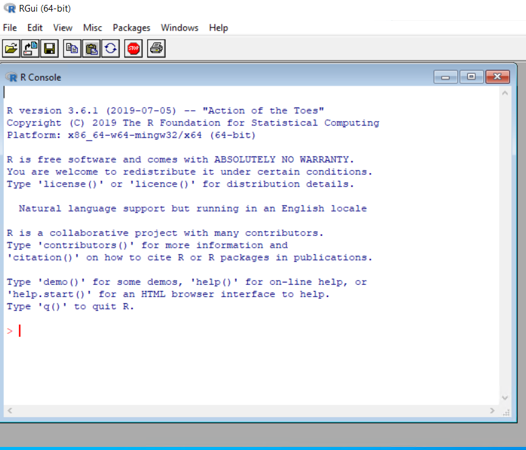


### 2. Install Python

Python packages are available at the [Python website](https://www.python.org/downloads/). It supports many operating systems, such as Windows, Linux/Unix, and Mac OS X. 

Download the Windows version and then install it on the machine. In this article, Python 3.7.4 64bit is used. You need to verify the installation path or choose the **Add Python 3.7 to PATH** option to add the Python installation path to the PATH environment variable. However, the **Add Python 3.7 to PATH** option may introduce the version conflicts among the installed Python versions. If you have multiple versions of Python installed on the machine, please beware of this option.


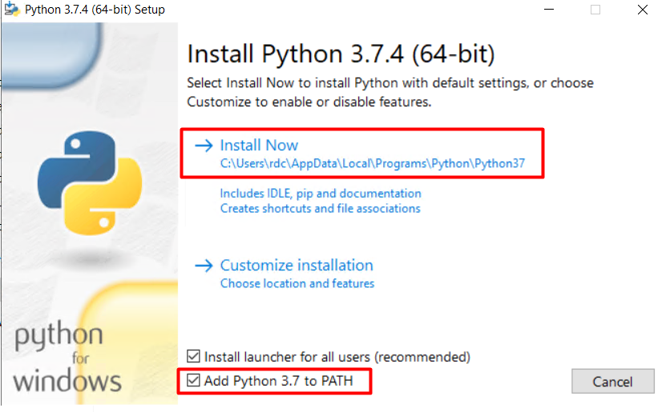

After installing, open the Windows Command Prompt to verify the version of Python (python --version).


You may install different Python Distributions, such as [Anaconda](https://www.anaconda.com/distribution/). Please refer to the Anaconda website for more information.

### 3. Install Jupyter Notebook

Jupyter Notebook can be installed with the **pip** command. Open the Windows Command Prompt and use the following commands to install Jupyter Notebook.

```
python -m pip install --upgrade pip
python -m pip install jupyter
```

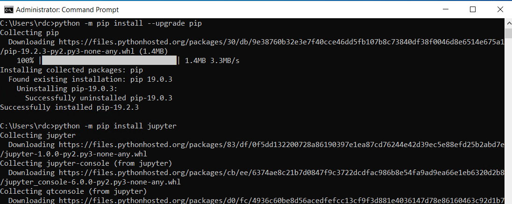
Then, run **jupyter notebook** from the Windows Command Prompt to start the Jupyter Notebook.

At this time, the Jupyter Notebook only supports **Python 3**.

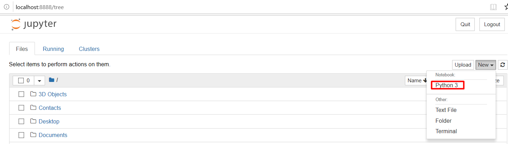

For different Python distributions, please refer the distribution websites regarding how to install Jupyter Notebook.

### 4. Install R kernel for Jupyter Notebook

Jupyter Notebook has kernels which are processes that run interactive code in a particular programming language and return output to the user. [IRkernel](https://irkernel.github.io/) is an R kernel for Jupyter Notebook.

IRkernel can be installed via [the Comprehensive R Archive Network [CRAN]](https://cloud.r-project.org/index.html). Open the **R x64 GUI** and follow these steps.

#### Installing via CRAN

You can install the IRkernel packages by running to the following command in an R console:

```
install.packages('IRkernel')
```

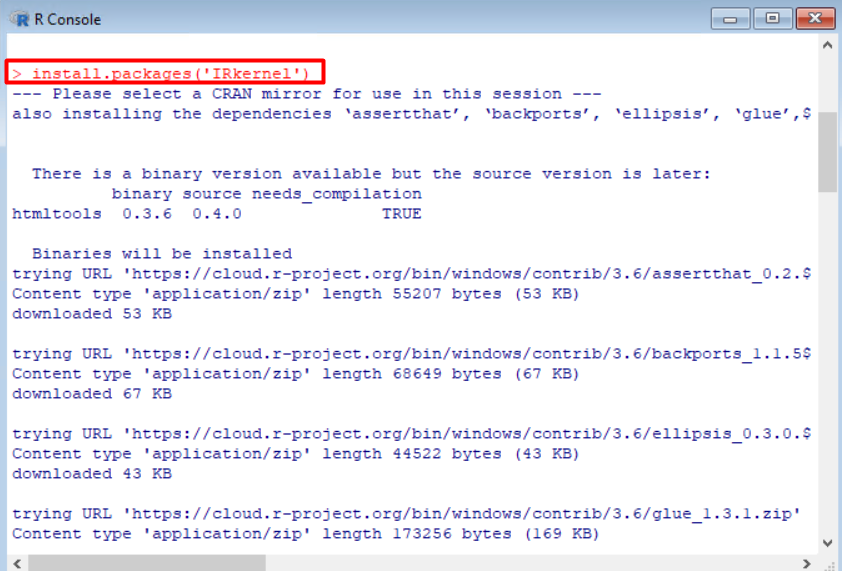

#### Making the kernel available to Jupyter

Then, you will have to make Jupyter see the newly installed R kernel by installing a kernel spec. To install system-wide, set user to False in the **installspec** command:

```
IRkernel::installspec(user = FALSE)
```

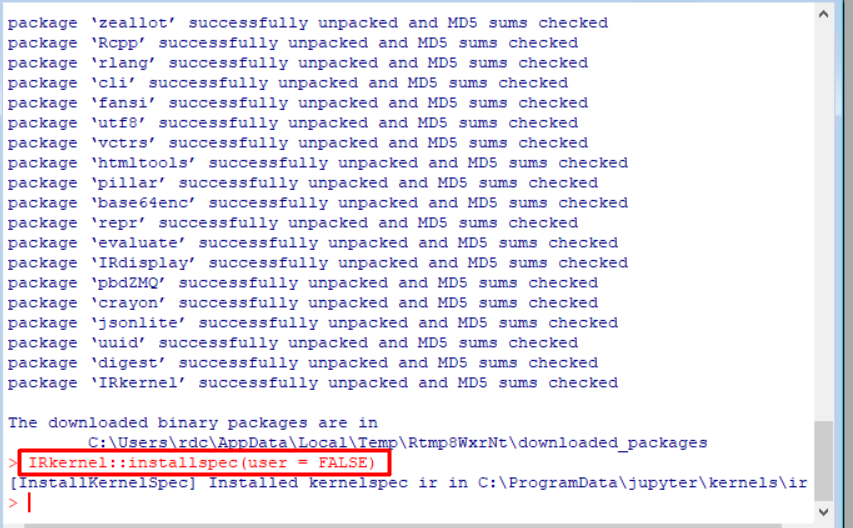

Then, run **jupyter notebook** via the Windows Command Prompt. Now, the Jupyter Notebook supports both Python 3 and R programming languages.

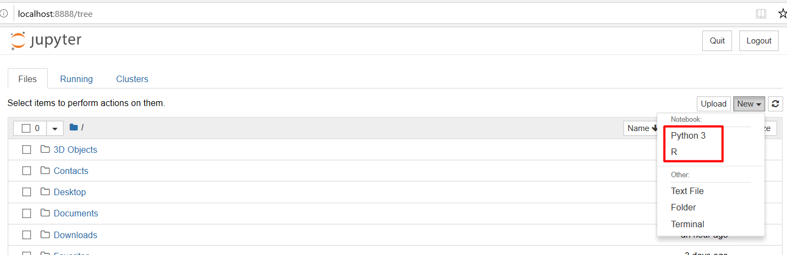

### 5. Install Refinitiv's APIs for R

Currently, there are two Refinitiv's APIs for R programming language which are available in GitHub. 

Before installing Refinitiv's APIs for R, the [Rtools](https://cran.r-project.org/bin/windows/Rtools/) must be installed on the Windows machine. In this article, **Rtools35.exe** which supports R 3.3.x and later is used. 

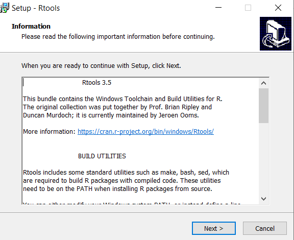


#### [Eikon Data API](https://developers.refinitiv.com/eikon-apis/eikon-data-api)

Eikon Data API allows users to access Eikon Data directly from any application running on the Eikon Desktop. The R version is available at [https://github.com/ahmedmohamedali/eikonapir](https://github.com/ahmedmohamedali/eikonapir). 


To install the Eikon Data API for R, open the **R x64 GUI** and run the following commands:

- **install.packages("devtools")**
>If the **devtools** package is not installed, use this command to install the **devtools** package. This R package makes package development easier by providing R functions that simplify and expedite common tasks. It contains the **install_github()** functions used to install R package from GitHub.

- **library(devtools)**
> Load and attach the **devtools** package

- **install_github("ahmedmohamedali/eikonapir")**
> Call the **intstall_github** function to install **eikonapir** from GitHub


#### [Datastream Web Service](https://developers.refinitiv.com/eikon-apis/datastream-web-service)

Datastream is the world’s leading time-series database, enabling strategists, economists and research communities’ access to the most comprehensive financial information available. With histories back to the 1950’s, you can explore relationships between data series; perform correlation analysis, test investment and trading ideas and research countries, regions and industries.

The R version of Datastream is available at [https://github.com/CharlesCara/DatastreamDSWS2R](https://github.com/CharlesCara/DatastreamDSWS2R)

To install the Datastream API for R, open the **R x64 GUI** and run the following commands:

- **install.packages("devtools")**
>If the **devtools** package is not installed, use this command to install the **devtools** package. This R package makes package development easier by providing R functions that simplify and expedite common tasks. It contains the **install_github()** functions used to install R package from GitHub.

- **library(devtools)**
> Load and attach the **devtools** package

- **install.packages("dplyr")**
> The **dplyr** package is required by the **DatastreamDSWS2R** package. The **dplyr** package provides a fast, consistent tool for working with data frames like objects, both in memory and out of memory.

- **install_github("CharlesCara/DatastreamDSWS2R")**
> Call the **intstall_github** function to install **DatastreamDSWS2R** from GitHub

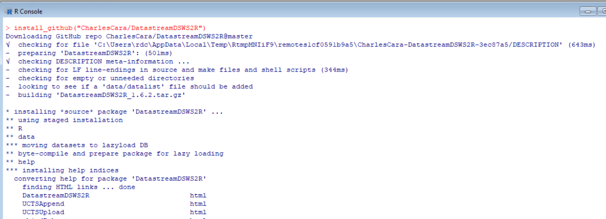

### 6. Install Plotly for R
[Plotly](https://plot.ly/r/getting-started/) is an R package for creating interactive web-based graphs via the open-source JavaScript graphing library plotly.js. This package is used by examples in this article to plot charts. Plotly is now on CRAN. To install Plotly, open the **R x64 GUI** and run the following commands:

```
install.packages("plotly")
```
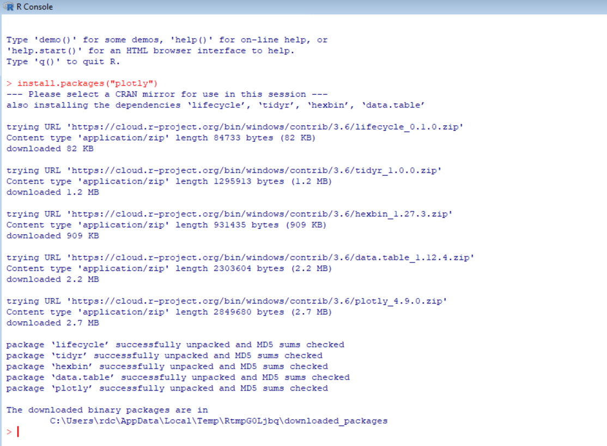

To test the package, you can run the following code under Jupyter Notebook to see the chart.

```
library(plotly)
p <- plot_ly(midwest, x = ~percollege, color = ~state, type = "box")
p
```
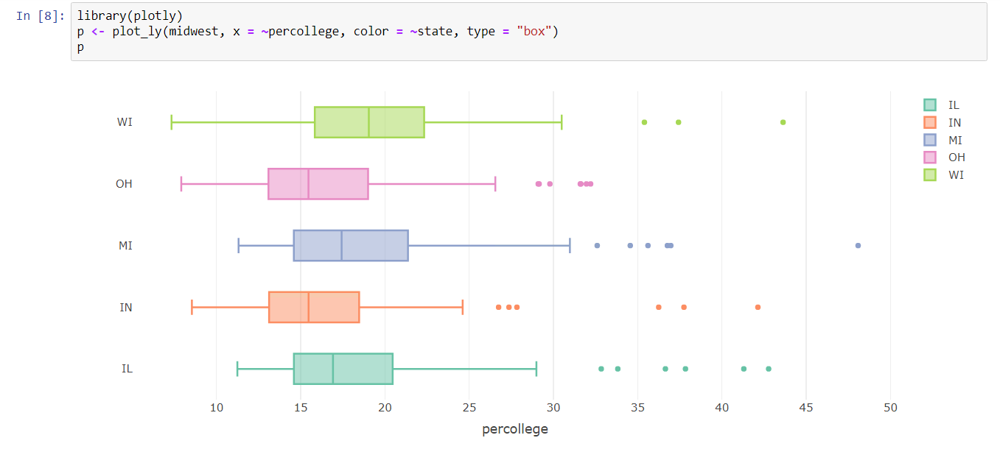


## Examples
The R examples for Jupyter are available in [GitHub](https://github.com/Refinitiv-API-Samples/Example.RefinitivAPIs.R.Jupyter).

1. [Eikon Data API R Example](https://github.com/Refinitiv-API-Samples/Example.RefinitivAPIs.R.Jupyter/tree/master/EikonDataAPIR): This example demonstrates how to use Eikon Data API with R on Jupyter Notebook to retrieve the latest data, historical data, symbology, and news. It uses the [eikonapir](https://github.com/ahmedmohamedali/eikonapir) package to retrieve data from Eikon and uses [Plotly](https://plot.ly/r/getting-started/) package to draw charts. It also uses the [IRDisplay](https://www.rdocumentation.org/packages/IRdisplay) package to display news in HTML format.

2. [DataStream R Example](https://github.com/Refinitiv-API-Samples/Example.RefinitivAPIs.R.Jupyter/tree/master/DataStreamR): This example demonstrates how to use DataStream Web Service with R on Jupyter Notebook. It uses the [DatastreamDSWS2R](https://github.com/CharlesCara/DatastreamDSWS2R/tree/master/R) package to retrieve data from DataStream Web Service and uses [Plotly](https://plot.ly/r/getting-started/) package to draw charts.

3. [Refinitiv Data Platform R Example](https://github.com/Refinitiv-API-Samples/Example.RefinitivAPIs.R.Jupyter/tree/master/RefinitivDataPlatformAPIR): This example demonstrates how to retrieve historical data from the Refinitiv Data Platform with R on Jupyter Notebook. It uses the [httr](https://cran.r-project.org/web/packages/httr/vignettes/quickstart.html) package to send HTTP request messages and uses [Plotly](https://plot.ly/r/getting-started/) package to draw charts.

## Troubleshoot

- Get "**please set environment variable 'TZ'**" error while installing Refinitiv's APIs from GitHub

```
Downloading GitHub repo ahmedmohamedali/eikonapir@master
...  
Warning in as.POSIXlt.POSIXct(x, tz) :
  
   Warning in as.POSIXlt.POSIXct(x, tz) :
     unable to identify current timezone 'C':
   please set environment variable 'TZ'

...   

Error in strptime(xx, f, tz = tz) : 
  (converted from warning) unable to identify current timezone 'C':
please set environment variable 'TZ'
Error: Failed to install 'eikonapir' from GitHub:

```

>The solution is using the below command to set the TZ environment variable.
```
Sys.setenv(TZ='Asia/Bangkok')
```
>The list of TZ database time zones is at [https://en.wikipedia.org/wiki/List_of_tz_database_time_zones](https://en.wikipedia.org/wiki/List_of_tz_database_time_zones). 


## References
1. https://en.wikipedia.org/wiki/R_(programming_language)
2. https://www.r-project.org/
3. https://www.python.org
4. https://www.anaconda.com/distribution/
5. https://jupyter.org/install
6. https://irkernel.github.io/
7. https://developers.refinitiv.com/eikon-apis/eikon-data-api
8. https://developers.refinitiv.com/eikon-apis/datastream-web-service
9. https://en.wikipedia.org/wiki/List_of_tz_database_time_zones
10. https://www.rdocumentation.org/packages/dplyr/versions/0.7.8
11. https://plot.ly/r/getting-started/
